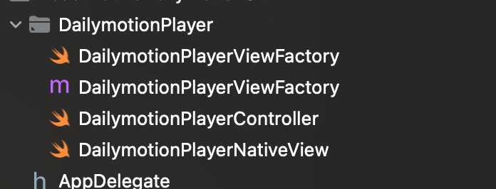

# Dailymotion SDK Integration with React Native

## Android SDK Configuration

### Adding Dependencies and Repository Configuration

1. Open settings.gradle

   Open the `settings.gradle` file in the root of your React Native project.

2. Add Dependency Resolution Management

   Add the following code at the top of your `settings.gradle` file:

   ```java
   dependencyResolutionManagement {
       repositoriesMode.set(RepositoriesMode.PREFER_SETTINGS)
       repositories {
           google()
           mavenCentral()
           maven {
               name = "DailymotionMavenRelease"
               url = "https://mvn.dailymotion.com/repository/releases/"
           }
       }
   }

   // ... (other existing code)
   ```

3. Open build.gradle (app)

   Open the `build.gradle` file in the app directory of your React Native project.

4. Add DailyMotion SDK Dependencies

   Add the following lines to the dependencies section of your `build.gradle` file:

   ```
   android {
    // ... (other existing code)

    dependencies {
        // ... (other existing dependencies)

        implementation 'com.dailymotion.player.android:sdk:1.2.4'
        implementation 'com.dailymotion.player.android:ads:1.2.4'
    }
   }

   ```

5. Explanation

   In the added code, we configured the dependency resolution management in `settings.gradle` to include the DailyMotion Maven repository. This allows your project to resolve dependencies from the specified Maven repository.

   In the `build.gradle` file, we added the DailyMotion SDK dependencies to the `implementation` section. This includes the main SDK (`com.dailymotion.player.android:sdk:1.2.1`) and the ads module (`com.dailymotion.player.android:ads:1.2.2`).

   These steps are necessary for integrating the DailyMotion SDK into your React Native Android project.

### Registering the Package in MainApplication.java

1. **Locate MainApplication.kt:** In your React Native project, navigate to the `android/app/src/main/java/com/yourAppName` directory. Inside this directory, you'll find the `MainApplication.java` file.
2. **Add Import Statements:** At the top of the MainApplication.java file, import the necessary classes.

   ```kotlin
   // Replace 'yourpackage' with your actual package name
   import com.yourpackage.DailymotionPlayer.DailymotionPlayerViewFactory;
   ```

3. Register the package Inside the `getPackages()` method in `MainApplication.kt`, add an instance of your package to the list of packages.

   ```java
   override fun getPackages(): List<ReactPackage> =
     PackageList(this).packages.apply {
        add(DailymotionPlayerViewFactory())
     }
   ```

   Ensure that you're using your actual package name in place of `yourpackage`. This registration allows React Native to access the functionality provided by your `DailymotionPlayerViewFactory`.

### Adding FragmentManager in MainActivity

1. Open MainActivity.kt

   Open the `MainActivity.kt` file in your React Native Android project.

2. Add FragmentManager Declaration

   Add the following line at the top of your `MainActivity` class to declare `mSupportFragmentManager`:

   ```kotlin
   private var mSupportFragmentManager: FragmentManager? = null
   ```

   Your `MainActivity` class should look like this:

   ```kotlin
     package com.yourapp

     import android.os.Bundle
     import android.util.Log
     import androidx.fragment.app.FragmentManager
     import com.facebook.react.ReactActivity
     import com.facebook.react.ReactActivityDelegate
     import com.facebook.react.defaults.DefaultNewArchitectureEntryPoint.fabricEnabled
     import com.facebook.react.defaults.DefaultReactActivityDelegate

     class MainActivity : ReactActivity() {

        private var mSupportFragmentManager: FragmentManager? = null

        override fun getMainComponentName(): String = "ReactNativeDailymotionSDK"

        override fun createReactActivityDelegate(): ReactActivityDelegate =
           DefaultReactActivityDelegate(this, mainComponentName, fabricEnabled)

        override fun onCreate(savedInstanceState: Bundle?) {
           super.onCreate(savedInstanceState)

           mSupportFragmentManager = supportFragmentManager
        }

        fun getSupportFragmentManagerInstance(): FragmentManager? {
           return mSupportFragmentManager
        }
     }
   ```

3. Save Changes

   Save the changes to `MainActivity.kt`.

4. Explanation

   In the added code, we declare a `public static FragmentManager mSupportFragmentManager` variable in the `MainActivity` class. This variable is initialized in the `onCreate` method, allowing you to access the `FragmentManager` from other parts of your application.

   This modification is necessary for enabling fullscreen capability in the DailyMotion SDK, as it relies on the `FragmentManager` provided by the hosting activity.

### Adding a layout

Create or update the `activity_main.xml` file in the `res/layout` directory. This file will define the layout for your the player.

```xml
<?xml version="1.0" encoding="utf-8"?>

<FrameLayout android:id="@+id/playerContainerView"
    android:layout_width="match_parent"
    xmlns:android="http://schemas.android.com/apk/res/android"
    android:layout_height="match_parent">
</FrameLayout>

```

navigate to the `android/app/src/main/java/com/yourAppName` directory, create directory called `DailymotionPlayer`. Inside this directory, create a class called `DailyPlayerPackage.kt`

```kotlin
package com.yourapp.DailymotionPlayer

import android.view.View
import com.facebook.react.ReactPackage
import com.facebook.react.bridge.NativeModule
import com.facebook.react.bridge.ReactApplicationContext
import com.facebook.react.uimanager.ReactShadowNode
import com.facebook.react.uimanager.ViewManager

class DailymotionPlayerViewFactory: ReactPackage {
    override fun createViewManagers(reactContext: ReactApplicationContext): MutableList<ViewManager<out View, out ReactShadowNode<*>>> {
        return mutableListOf(
            DailymotionPlayerController()
        )
    }

    override fun createNativeModules(
        reactContext: ReactApplicationContext
    ): MutableList<NativeModule> = ArrayList()
}
```

after that, create class called `DailymotionPlayerController.java`:

```java
package com.dailymotionplayerintegration.DailymotionPlayer;

import android.widget.FrameLayout;

import androidx.annotation.NonNull;
import androidx.annotation.Nullable;
import com.facebook.react.uimanager.SimpleViewManager;
import com.facebook.react.uimanager.ThemedReactContext;
import com.facebook.react.uimanager.annotations.ReactProp;

class DailymotionPlayerController extends SimpleViewManager<FrameLayout> {

    @NonNull
    @Override
    public String getName() {
        return "DailymotionPlayerNative";
    }

    @Override
    protected FrameLayout createViewInstance(@NonNull ThemedReactContext reactContext) {
        return new DailymotionPlayerNativeView(reactContext);
    }

    @ReactProp(name = "videoId")
    public void setPropVideoId(DailymotionPlayerNativeView view, @Nullable String param) {
        view.setVideoId(param);
    }

    @ReactProp(name = "playerId")
    public void setPlayerId(DailymotionPlayerNativeView view, @Nullable String param) {
        view.setPlayerId(param);
    }
}
```

The last file that we need to create is `DailymotionPlayerNativeView.kt`:

```kotlin
package com.reactnativedailymotionsdk.DailymotionPlayer

import android.content.Context
import android.util.Log
import android.view.View
import android.widget.FrameLayout
import androidx.fragment.app.DialogFragment
import com.dailymotion.player.android.sdk.Dailymotion
import com.dailymotion.player.android.sdk.PlayerView
import com.dailymotion.player.android.sdk.listeners.PlayerListener
import com.dailymotion.player.android.sdk.webview.error.PlayerError
import com.reactnativedailymotionsdk.MainActivity
import com.reactnativedailymotionsdk.R
import com.facebook.react.bridge.ReactContext
import com.facebook.react.uimanager.ThemedReactContext

class DailymotionPlayerNativeView(context: ThemedReactContext?) : FrameLayout(context!!) {

    private var playerId: String = ""
    private var videoId: String = ""
    private var dmPlayer: PlayerView? = null

    private fun getReactContext(): ReactContext? {
        return context as ReactContext
    }

    init {
        inflate(getReactContext(), R.layout.activity_main, this)
    }

    override fun requestLayout() {
        super.requestLayout()

        // This view relies on a measure + layout pass happening after it calls requestLayout().
        // https://github.com/facebook/react-native/issues/4990#issuecomment-180415510
        // https://stackoverflow.com/questions/39836356/react-native-resize-custom-ui-component
        post(measureAndLayout)
    }

    private val measureAndLayout = Runnable {
        measure(
                MeasureSpec.makeMeasureSpec(width, MeasureSpec.EXACTLY),
                MeasureSpec.makeMeasureSpec(height, MeasureSpec.EXACTLY)
        )
        this.layout(left, top, right, bottom)
    }

    private fun loadThePlayer(): Any {
        val currentActivity = getReactContext()?.currentActivity

        if (currentActivity != null) {

            // Create and configure the Dailymotion PlayerView
            val playerView = PlayerView(getReactContext()!!)

            val playerContainerView = findViewById<View>(R.id.playerContainerView) as FrameLayout

            if (playerContainerView.layoutParams != null) {
                playerView.layoutParams = playerContainerView.layoutParams
            } else {
                Log.e("--DailymotionPlayer--", "No playerContainerView found")
            }

            return createDailymotionPlayer(
                    context,
                    playerId = playerId!!,
                    playerContainerView = playerContainerView
            )
        }
        Log.e("--DailymotionPlayer--", "Container null")

        return View(context) as PlayerView
    }

    fun createDailymotionPlayer(
            context: Context,
            playerId: String,
            playerContainerView: FrameLayout
    ) {

        Log.d("--DailymotionPlayer--", "createDailymotionPlayer")

        Dailymotion.createPlayer(
                context,
                playerId = playerId,
                playerSetupListener =
                object : Dailymotion.PlayerSetupListener {
                    override fun onPlayerSetupFailed(error: PlayerError) {
                        Log.e(
                                "--DailymotionPlayer--",
                                "Error while creating Dailymotion player: ${error.message}"
                        )
                    }

                    override fun onPlayerSetupSuccess(player: PlayerView) {
                        val lp = LayoutParams(LayoutParams.MATCH_PARENT, LayoutParams.MATCH_PARENT)
                        dmPlayer = player
                        playerContainerView.addView(dmPlayer, lp)

                        Log.d(
                                "--DailymotionPlayer--",
                                "Added Dailymotion player ${dmPlayer} to view hierarchy"
                        )
                        runTheVideo()
                    }
                },
                playerListener =
                object : PlayerListener {
                    override fun onFullscreenRequested(playerDialogFragment: DialogFragment) {
                        super.onFullscreenRequested(playerDialogFragment)
                        val currentActivity = getReactContext()?.currentActivity
                        if (currentActivity is MainActivity) {
                            currentActivity.getSupportFragmentManagerInstance()?.let {
                                playerDialogFragment.show(it, "dmPlayerFullscreenFragment")
                            }
                        }
                    }

                }
        )
    }

    fun setVideoId(videoId: String) {
        this.videoId = videoId
        Log.d("--DailymotionPlayer--", "Set video id ${this.videoId}")
    }

    fun setPlayerId(playerId: String) {
        this.playerId = playerId
        Log.d("--DailymotionPlayer--", "Set player id ${this.playerId}")
        loadThePlayer()
    }

    fun runTheVideo() {
        dmPlayer!!.loadContent(videoId=videoId)
    }
}
```

## iOS SDK Configuration

### Install Dailymotion iOS SDK

1. Open `/ios/YourProject.xcworkspace` in Xcode.
2. Install DailymotionSDK in your project [https://github.com/dailymotion/player-sdk-ios](https://github.com/dailymotion/player-sdk-ios)

### **Create DailymotionPlayer Folder:**

Create a new folder named `DailymotionPlayer` in your ReactNative iOS project's directory. Inside this folder we will create 4 files, by using right click on the folder

1. `DailymotionPlayerViewFactory.swift`
2. `DailymotionPlayerViewFactory.m`
3. `DailymotionPlayerController.swift`
4. `DailymotionPlayerNativeView.swift`



When you create a Swift file there will be popup open, then hit the button `Create bridging header` . We have to create this file because, we are going to write our iOS native module in with **swift**, but the entire application was built on `Objective C` , This bridging header file will help us on maintain the communication between `Swift and Objective C`

Open `YourAppName-Bridging-Header.h` file, add below line into it and save the file

```kotlin
//
//  Use this file to import your target's public headers that you would like to expose to Swift.
//
#import <React/RCTBridgeModule.h>
#import <React/RCTViewManager.h>
```

### Open DailymotionPlayerViewFactory.swift

Copy and paste the following code into the file

```kotlin
import Foundation
import SwiftUI

@objc(DailymotionPlayerNative)
class DailymotionPlayerViewFactory: RCTViewManager {

  override static func requiresMainQueueSetup() -> Bool {
    return true
  }

  override func view() -> UIView! {
    return DailymotionPlayerNativeView()
  }

}
```

**Class Declaration:**

- `@objc(DailymotionPlayerNative)` is used to expose the class to Objective-C, which is necessary for React Native to recognize it.
- `DailymotionPlayerViewFactory` inherits from `RCTViewManager`, a base class provided by React Native to manage native views.

**Method Overrides:**

- `requiresMainQueueSetup` returns `true`, indicating that the view should be set up on the main queue.
- `view` method returns an instance of `DailymotionPlayerNativeView`, which would be the custom view that handles the Dailymotion player.

### Create `DailymotionPlayerNativeView`

1. Add the following code:

```swift

import Foundation
import UIKit
import DailymotionPlayerSDK
import SwiftUI

@objc(DailymotionPlayerNativeView)
class DailymotionPlayerNativeView:  UIView {

  private var playerController: DailymotionPlayerController?

  @objc var status = false {
    didSet {
      updateViewIfNeeded()
    }
  }

  @objc var videoId = "" {
    didSet {
      updateViewIfNeeded()
    }
  }

  @objc var playerId = "" {
    didSet {
      updateViewIfNeeded()
    }
  }


  override init(frame: CGRect) {
    super.init(frame: frame)
    setupView()
  }

  required init?(coder aDecoder: NSCoder) {
    super.init(coder: aDecoder)
  }

  private func setupView() {

    if(playerId.isEmpty){
      return
    }

    // Remove all existing subviews to prevent duplicates.
    self.subviews.forEach { $0.removeFromSuperview() }


    let defaultParameters = DMPlayerParameters(mute: false, defaultFullscreenOrientation: .landscapeRight)

    playerController = DailymotionPlayerController(
      parent: self,
      playerId: playerId,
      videoId: videoId,
      parameters: defaultParameters
    )

    self.addSubview(playerController!.view)

  }

  private func updateViewIfNeeded() {
    // Ensure both videoId and playerId are present before calling setupView
    if !videoId.isEmpty && !playerId.isEmpty {
      setupView()
    }
  }
}

```

- **Imports:**
  - `Foundation`, `UIKit`, `DailymotionPlayerSDK`, and `SwiftUI` provide necessary functionalities for the class.
- **Class Declaration:**
  - `DailymotionPlayerNativeView` inherits from `UIView` and manages the Dailymotion player view.
- **Properties:**
  - `playerController` manages the Dailymotion player.
  - `status`, `videoId`, and `playerId` are properties that update the view when changed.
- **Initialization:**
  - The `init(frame:)` and `init?(coder:)` methods initialize the view and call `setupView()`.
- **Methods:**
  - `setupView()` sets up the Dailymotion player.
  - `updateViewIfNeeded()` ensures the player is updated only when both `videoId` and `playerId` are present.

### Create DailymotionPlayerController.swift

Copy the code below, this file is to call and create the dailymotion palyer

```swift
import Foundation
import UIKit
import DailymotionPlayerSDK
import SwiftUI

class DailymotionPlayerController: UIViewController, ObservableObject, DMVideoDelegate, DMAdDelegate {
  
    var playerId: String?
    var videoId: String = ""
    
    var _parent: UIView
    var playerView: DMPlayerView?
    var parameters: DMPlayerParameters?
  
    // Initialize the class with playerId and videoId
    init(parent: UIView, playerId: String?, videoId: String, parameters: DMPlayerParameters? = nil) {
        self._parent = parent
        self.playerId = playerId
        self.videoId = videoId
        self.parameters = parameters ?? DMPlayerParameters(mute: false, defaultFullscreenOrientation: .portrait)
        
        super.init(nibName: nil, bundle: nil)
    }
  
    required init?(coder aDecoder: NSCoder) {
        fatalError("init(coder:) has not been implemented")
    }
  
    override func viewDidLoad() {
        super.viewDidLoad()
        Task {
            await initPlayer()
        }
    }
  
    func initPlayer(with parameters: DMPlayerParameters? = nil) async {
        do {
            let playerView = try await Dailymotion.createPlayer(playerId: playerId ?? "xix5x", videoId: videoId, playerParameters: (parameters ?? self.parameters)!, playerDelegate: self, videoDelegate: self, adDelegate: self, logLevels: [.all])
            addPlayerView(playerView: playerView)
        } catch {
            handlePlayerError(error: error)
        }
    }
  
    private func addPlayerView(playerView: DMPlayerView) {
        self.playerView = playerView
    
        // Add [player wrapper] as a subview of a parent
        self._parent.addSubview(playerView)
    
        let constraints = [
            playerView.topAnchor.constraint(equalTo: self._parent.topAnchor),
            playerView.bottomAnchor.constraint(equalTo:  self._parent.bottomAnchor),
            playerView.leadingAnchor.constraint(equalTo:self._parent.leadingAnchor),
            playerView.trailingAnchor.constraint(equalTo: self._parent.trailingAnchor)
        ]
    
        NSLayoutConstraint.activate(constraints)
    
        print("Player view added", self.playerView!)
    }
  
    func play() {
        self.playerView?.play()
    }
  
    func pause() {
        self.playerView?.pause()
    }
  
    func load(videoId: String) {
        self.playerView?.loadContent(videoId: videoId)
    }
  
    private func sendEvent(name: String) {
        let eventData: [String: Any] = ["name": name]
        NotificationCenter.default.post(name: Notification.Name("DailymotionPlayerEvent"), object: nil, userInfo: eventData)
    }
  
    func handlePlayerError(error: Error) {
        switch(error) {
        case PlayerError.advertisingModuleMissing:
            break
        case PlayerError.stateNotAvailable:
            break
        case PlayerError.underlyingRemoteError(let error):
            let error = error as NSError
            if let errDescription = error.userInfo[NSLocalizedDescriptionKey],
               let errCode = error.userInfo[NSLocalizedFailureReasonErrorKey],
               let recovery = error.userInfo[NSLocalizedRecoverySuggestionErrorKey] {
                print("Player Error : Description: \(errDescription), Code: \(errCode), Recovery : \(recovery)")
            } else {
                print("Player Error : \(error)")
            }
        case PlayerError.requestTimedOut:
            print(error.localizedDescription)
        case PlayerError.unexpected:
            print(error.localizedDescription)
        case PlayerError.internetNotConnected:
            print(error.localizedDescription)
        case PlayerError.playerIdNotFound:
            print(error.localizedDescription)
        case PlayerError.otherPlayerRequestError:
            print(error.localizedDescription)
        default:
            print(error.localizedDescription)
        }
    }
  
    // Handle view lifecycle events to pause the video
    override func viewWillAppear(_ animated: Bool) {
        super.viewWillAppear(animated)
        NotificationCenter.default.addObserver(self, selector: #selector(handleAppBackground), name: UIApplication.didEnterBackgroundNotification, object: nil)
        NotificationCenter.default.addObserver(self, selector: #selector(handleAppForeground), name: UIApplication.willEnterForegroundNotification, object: nil)
    }
  
    override func viewWillDisappear(_ animated: Bool) {
        super.viewWillDisappear(animated)
        // Pause the video when the view is about to disappear
        self.playerView?.pause()
        NotificationCenter.default.removeObserver(self, name: UIApplication.didEnterBackgroundNotification, object: nil)
        NotificationCenter.default.removeObserver(self, name: UIApplication.willEnterForegroundNotification, object: nil)
    }
  
    @objc func handleAppBackground() {
        // Pause the video when the app goes to the background
        self.playerView?.pause()
    }
  
    @objc func handleAppForeground() {
        // Optionally handle app coming back to the foreground
    }
}

extension DailymotionPlayerController: DMPlayerDelegate {
    func player(_ player: DailymotionPlayerSDK.DMPlayerView, openUrl url: URL) {
        // Handle URL opening
    }
  
    func playerDidRequestFullscreen(_ player: DMPlayerView) {
        player.notifyFullscreenChanged()
    }
  
    func playerDidExitFullScreen(_ player: DMPlayerView) {
        player.notifyFullscreenChanged()
    }
  
    func playerWillPresentFullscreenViewController(_ player: DMPlayerView) -> UIViewController? {
        return self
    }
  
    func playerWillPresentAdInParentViewController(_ player: DMPlayerView) -> UIViewController {
        return self
    }
  
    func player(_ player: DMPlayerView, didChangeVideo changedVideoEvent: PlayerVideoChangeEvent) {
        print("--playerDidChangeVideo")
    }
  
    func player(_ player: DMPlayerView, didChangeVolume volume: Double, _ muted: Bool) {
        print("--playerDidChangeVolume")
    }
  
    func playerDidCriticalPathReady(_ player: DMPlayerView) {
        print("--playerDidCriticalPathReady")
    }
  
    func player(_ player: DMPlayerView, didReceivePlaybackPermission playbackPermission: PlayerPlaybackPermission) {
        print("--playerDidReceivePlaybackPermission")
    }
  
    func player(_ player: DMPlayerView, didChangePresentationMode presentationMode: DMPlayerView.PresentationMode) {
        print("--playerDidChangePresentationMode", player.isFullscreen)
    }
  
    func player(_ player: DMPlayerView, didChangeScaleMode scaleMode: String) {
        print("--playerDidChangeScaleMode")
    }
}

```

## Using DailyMotionPlayer Package in React Native

In your React Native code, import the Native Module using `requireNativeComponent` and use it in your component.

```jsx
import {HostComponent, ViewStyle, requireNativeComponent} from 'react-native';

const DailyMotionPlayer: HostComponent<{
  videoId: string,
  playerId: string,
  style?: ViewStyle,
}> = requireNativeComponent('DailymotionPlayerNative');

export default DailyMotionPlayer;
```

in `App.tsx`, you can call the component

```tsx
<DailyMotionPlayer
  playerId="x9uwg"
  videoId="x8pbfnm"
  style={{
    height: 300,
    backgroundColor: 'black',
  }}
/>
```
